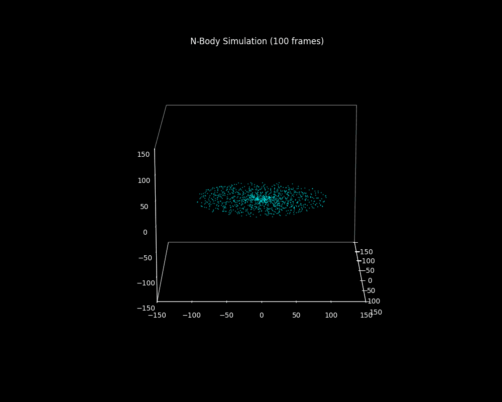

# 🌌 CUDA N-Body Galaxy Simulation

## 1. Project Overview

This project presents a GPU-accelerated N-body gravitational simulation implemented in CUDA. The goal is to model the motion of a large number of particles interacting under gravity, forming a galaxy-like system with a massive central object.

Two CUDA kernels are implemented:

- A simple brute-force version using only global memory  
- An optimized version using shared memory with a tiling approach  


### Simulation Preview


---

## 2. CUDA Implementation Overview

The simulation computes gravitational forces between all pairs of particles.  
This results in a computational complexity of O(N²), which is common for direct N-body methods. The two different cuda implementations are the following:


### 2.1 Naive Kernel

In the naive approach, each CUDA thread updates one particle. This method is easy to implement but inefficient because the same particle data is repeatedly loaded from slow global memory.
So, memory bandwidth becomes the main bottleneck and performance drops quickly as the number of particles increases  


### 2.2 Tiled Kernel Using Shared Memory

The optimized version divides the particles into small blocks (tiles). By reusing data stored in fast shared memory, the number of global memory accesses is greatly reduced.
This leads to a lower memory traffic, better GPU utilization, higher overall performance.


### 2.3 Complexity Analysis

| Method | Memory Usage | Compute Complexity | Bandwidth Pressure |
|-------|-------------|------------------|-------------------|
| Naive | Global memory only | O(N²) | Very high |
| Tiled | Global + Shared memory | O(N²) | Reduced |

---

## 3. Build and Run Instructions

### 3.1 Requirements
- NVIDIA CUDA Toolkit  
- Python  
- Python libraries listed in `requirements.txt`  

Default simulation parameters:

- Particles: 1024  
- Iterations: 10  
- Steps per frame: 20  
- Kernel: tiled  

### 3.2 Compilation and Execution

```bash
nvidia-smi
pip install -r requirements.txt
make

./nbody_sim -n 1024 -s 20 -i 10 -m tiled > output.csv
or
./nbody_sim -n 1024 -s 20 -i 10 -m naive > output.csv

python visualize.py -i output.csv
```

---

## 4. Results and Performance Comparison
###  4.1 Visual Output (with Default parameters)
| Naive Kernel | Tiled Kernel |
|--------------------|----------|
|   |  |
	

Both implementations produce the same physical motion of particles. The main difference lies in how fast the simulation runs.
###  4.2 Execution Time

| Number of Particles | Naive (s) | Tiled (s) | Speedup |
|--------------------|----------|----------|---------|
| 512  | 0.0788 | 0.0640 | 1.23× |
| 1024 | 0.167  | 0.125 | 1.34× |
| 2048 | 0.342  | 0.246 | 1.39× |
| 4096 | 0.692  | 0.485 | 1.43× |
| 8192 | 1.378  | 0.962 | 1.43× |


###  4.3 Performance Observations

-   Naive kernel becomes memory-bound very quickly
-   Tiled kernel minimizes redundant global memory reads
-   Speedup increases with particle count
-   Shared memory significantly improves arithmetic intensity

---

## 5. Conclusion

This project highlights the importance of memory optimization in CUDA programming. The optimized kernel reduces global memory traffic through data reuse in shared memory, leading to significant performance improvements while preserving physical accuracy.
Overall, the project demonstrates how thoughtful use of CUDA’s memory hierarchy can lead to more scalable GPU applications.
